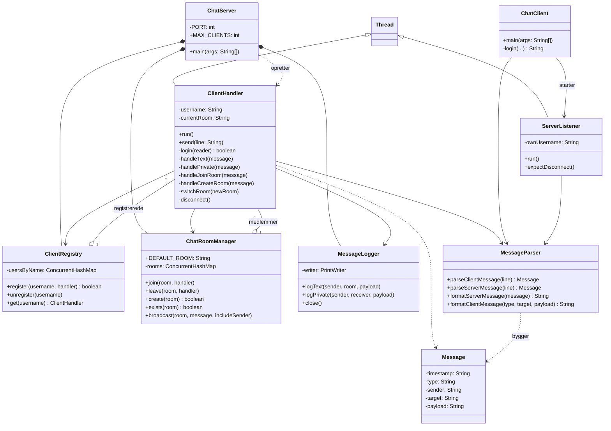

# Chatproject

Et konsolbaseret chatprogram i Java. Flere klienter kan forbinde til en fælles server chatte i rum, sende private beskeder skifte/oprette rum, og alle beskeder logges til fil.

## Sådan starter du server og klient

### Via IntelliJ 
1. Åbn projektet i IntelliJ.
2. Højreklik på `ChatServer.java` → **Run 'ChatServer.main()'**.
3. Højreklik på `ChatClient.java` → **Run 'ChatClient.main()'** — gentag i separate kørsler for hver klient (mindst 3, for at demonstrere kravet om samtidige klienter).

### Via terminal
```bash
mvn compile
java -cp target/classes org.example.ChatServer

# I nye terminaler (én pr. klient):
java -cp target/classes org.example.ChatClient
```

Serveren lytter på port `5001` på `localhost`.

## Protokol

Klient og server kommunikerer med linjebaserede beskeder adskilt af `|`.

**Klient → server:** `TYPE|TARGET|PAYLOAD`

| Kommando | Eksempel | Beskrivelse |
|---|---|---|
| `LOGIN` | `LOGIN||bob` | Log ind med et brugernavn (sendes i PAYLOAD, TARGET er tomt) |
| `TEXT` | `TEXT|general|Hej alle` | Send en besked til det rum, du er i |
| `PRIVATE` | `PRIVATE|alice|Hej Alice` | Send en privat besked til en bestemt bruger |
| `JOIN_ROOM` | `JOIN_ROOM|rum2|` | Skift til et eksisterende rum |
| `CREATE_ROOM` | `CREATE_ROOM|rum2|` | Opret et nyt rum og skift til det |
| `QUIT` | `QUIT||` | Log af og luk forbindelsen |

**Server → klient:** `TIMESTAMP|TYPE|SENDER|TARGET|PAYLOAD`

| Type | Eksempel | Beskrivelse |
|---|---|---|
| `LOGIN_OK` | `2026-09-18 10:00:00\|LOGIN_OK\|server\|general\|Velkommen bob` | Login lykkedes |
| `TEXT` | `...\|TEXT\|bob\|general\|Hej alle` | Besked broadcastet i et rum |
| `PRIVATE` | `...\|PRIVATE\|bob\|alice\|Hej Alice` | Privat besked (sendes til både afsender og modtager) |
| `INFO` | `...\|INFO\|server\|rum2\|Du er nu i rummet rum2` | Bekræftelse (rumskift, logget af) |
| `ERROR` | `...\|ERROR\|server\|bob\|Brugernavnet er optaget` | Fejlbesked - kommandoen kunne ikke udføres |

Serveren fastsætter altid `TIMESTAMP` og `SENDER` selv efter login — den stoler ikke på noget, klienten selv påstår om sin identitet.

## Klassediagram



## Trådmodel

- **Serveren** bruger en `ExecutorService` med et fast antal tråde (`Executors.newFixedThreadPool(MAX_CLIENTS)`). Hver ny forbindelse fra `serverSocket.accept()` pakkes ind i en `ClientHandler` og sendes til puljen med `execute()` — der oprettes altså *ikke* en ny rå OS-tråd for hver klient. Er alle tråde i puljen optaget, venter nye klienters `ClientHandler` blot i eksekverings-køen internt i `ExecutorService`, indtil en tråd bliver ledig; klienten oplever det som at serveren ikke svarer, ikke som en afvisning.
- **Klienten** kører to tråde: hovedtråden blokerer på tastatur-input og sender kommandoer, mens en separat `ServerListener`-tråd samtidig blokerer på at læse fra serveren og printer indkomne beskeder. Uden denne opdeling kunne klienten ikke modtage andres beskeder, mens den ventede på at brugeren skrev noget.

## Delte ressourcer og trådsikkerhed

`ClientRegistry` og `ChatRoomManager` holder tilstand som *alle* `ClientHandler`-tråde læser og skriver til samtidig:

- Begge er bygget på `ConcurrentHashMap`, som tillader sikker samtidig læsning/skrivning uden manuel `synchronized`-låsning.
- Unikke brugernavne (`ClientRegistry.register`) og unikke rumnavne (`ChatRoomManager.create`) bruger begge `putIfAbsent` — et atomisk "claim eller fejl"-kald. Selvom to brugere logger ind med samme navn i nøjagtig samme millisekund, garanterer `putIfAbsent` at kun den ene lykkes.
- Hvert rums medlemsliste er et `ConcurrentHashMap.newKeySet()` — trådsikkert, så flere `ClientHandler`-tråde kan joine/forlade/broadcaste samtidig.
- `MessageLogger`s skrive-metoder er `synchronized`, så beskeder fra flere tråde aldrig fletter sammen i logfilen.
- Når én bruger sender en besked, kalder deres tråd `.send()` direkte på *andre* brugeres `ClientHandler`-objekter (fra en fremmed tråd). Det er sikkert, fordi `PrintWriter.println` er internt synkroniseret i Java.

## Fejlhåndtering og oprydning

- Ukendte/fejlformaterede kommandoer crasher ikke serveren — afsenderen får et `ERROR`-svar, forbindelsen forbliver åben, og hændelsen logges server-side.
- En klient der forsvinder uden `QUIT` (netværksfejl, lukket vindue) opdages fordi `reader.readLine()` enten kaster en `IOException` eller returnerer `null`. Uanset årsag kører oprydning (`disconnect()`) i en `finally`-blok, så brugeren altid fjernes fra `ClientRegistry` og sit rum.
- En inaktiv klient logges automatisk af efter 10 minutter via `Socket.setSoTimeout`.

## Udvidelse: besked-logning

Alle `TEXT`- og `PRIVATE`-beskeder logges til en dateret fil i `logs/` (fx `logs/chatlog_2026-09-18.txt`), i formatet:

```
TIMESTAMP|AFSENDER|TYPE|MODTAGER|BESKED
```

`TYPE` er enten rummets navn (for offentlige beskeder, hvor `MODTAGER` altid er `public`) eller `PRIVATE` (hvor `MODTAGER` er den specifikke modtager). Findes dagens logfil allerede (fx efter en genstart), oprettes `_1`, `_2` osv. i stedet for at overskrive den forrige. Se `MessageLogger.java`.

## Sekvensdiagram: en ny bruger sender sin første besked

Se vedhæftet filer

## Test

### Automatiserede JUnit-tests
24 tests i `src/test/java/org/example`, kør med `mvn test`:

- `MessageParserTest` — parsing/formatering af begge beskedretninger, inkl. edge cases (ekstra pipes i payload, manglende felter, case-insensitive type).
- `ClientRegistryTest` — unikke brugernavne (register/unregister/get).
- `ChatRoomManagerTest` — rum-oprettelse og broadcast-isolation (via en `ClientHandler`-test-dobbelt der ikke rører en rigtig socket).
- `MessageLoggerTest` — fil-navngivning, "ingen overskrivning", og logformat.

### Manuelle integrationstests
| Scenarie | Resultat |
|---|---|
| Tre klienter forbindes samtidig | ✅ Alle kan sende/modtage |
| To brugere vælger samme brugernavn | ✅ Den anden afvises, kan prøve igen på samme forbindelse |
| Besked i et rum | ✅ Kun medlemmer af rummet modtager den |
| Privat besked | ✅ Kun afsender og modtager ser den |
| Fejlformateret/ukendt besked | ✅ Server crasher ikke, afsender får klar fejlbesked |
| Uventet afbrydelse (ingen QUIT) | ✅ Bruger fjernes øjeblikkeligt fra registre/rum |
| Inaktivitet i 10 minutter | ✅ Bruger logges automatisk af med besked |
| Besked-logning | ✅ Alle TEXT/PRIVATE-beskeder havner korrekt i `logs/` |

## Brug af AI

Vi har brugt Claude Code (Anthropic) gennem hele udviklingsforløbet til kodeforslag, fejlfinding, planlægning og test. Herunder nogle af de situationer, hvor det reelt gjorde en forskel:

| Opgave | AI-værktøj | AI's forslag | Vores vurdering og ændringer | Kontrol og test |
|---|---|---|---|---|
| Retry ved optaget brugernavn (issue #1) | Claude Code | Første udgave lukkede forbindelsen, hvis brugernavnet var optaget, i stedet for at lade klienten prøve igen | Vi opdagede at klienten crashede ved andet forsøg, og fik AI'en til at omskrive `login()` til en løkke der bliver ved med at læse nye forsøg | Testede manuelt: to afviste forsøg, tredje lykkedes, ingen crash |
| Inaktivitets-timeout (issue #11) | Claude Code | Første version fangede `SocketTimeoutException` *uden for* try-with-resources-blokken | Fejlbeskeden nåede aldrig klienten, fordi socket/writer allerede var lukket på det tidspunkt. Vi testede det selv og fik rettet til at fange exception'en inde i blokken | Genkørte den manuelle socket-test og bekræftede beskeden nu ankom |
| Ekko af egne beskeder | Claude Code | Foreslog at afsenderen får sin egen TEXT-besked ekkoet tilbage via broadcast, for konsistent tidsstempling | Vi diskuterede det og valgte selv at holde fast i det, efter at have overvejet alternativet (ingen ekko) | Testet manuelt med tre klienter |
| JUnit-test af `MessageLogger` fejlede | Claude Code | Testene fejlede alle fire, tilsyneladende tilfældigt | AI fandt roden: filen blev aldrig lukket, hvilket forhindrede JUnits `@TempDir` i at slette test-mappen på Windows. Vi fik tilføjet `Closeable` og try-with-resources i testene | Kørte alle 24 tests igen og bekræftede de bestod |
| Trådsikkerhed i `ClientRegistry`/`ChatRoomManager` | Claude Code | Foreslog `ConcurrentHashMap` + `putIfAbsent` for atomisk unik-tjek, samme mønster begge steder | Vi gennemgik forklaringen af hvorfor det er sikkert (ingen ekstern synkronisering nødvendig) og kunne selv redegøre for det | Testet med samtidige login-forsøg på samme brugernavn |

Vi har læst, testet og forstået al AI-genereret kode, og kan forklare protokollen, trådmodellen og de delte ressourcer i detaljer.
